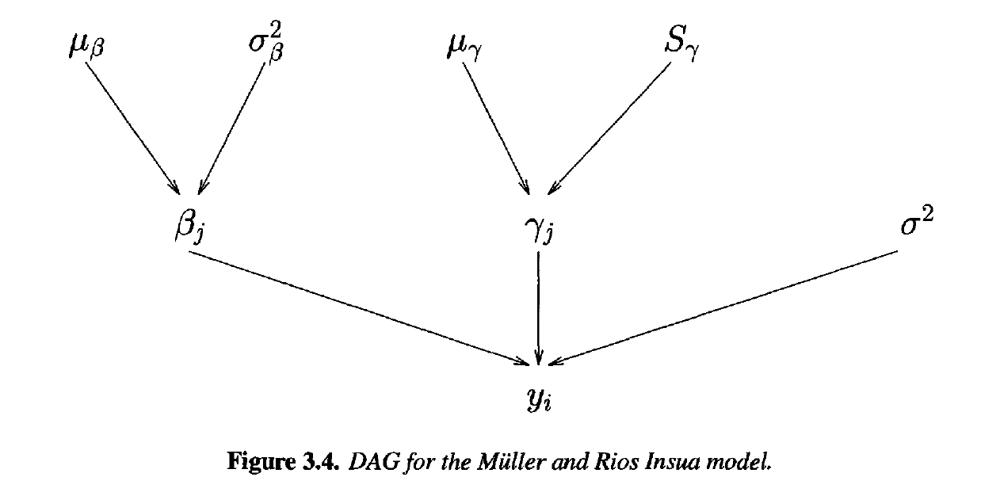
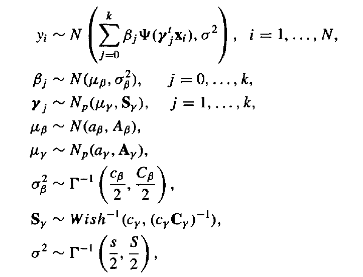
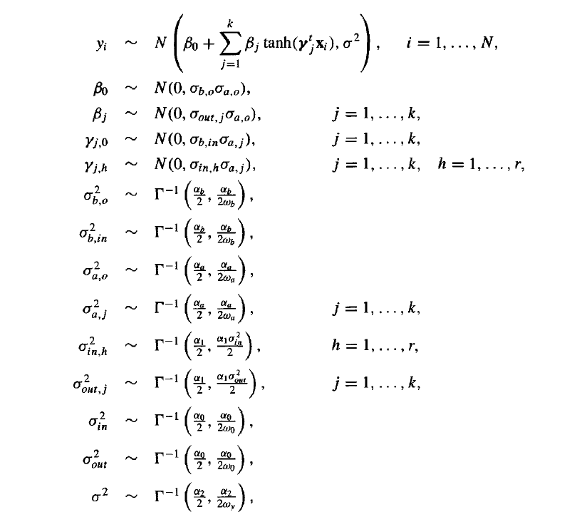
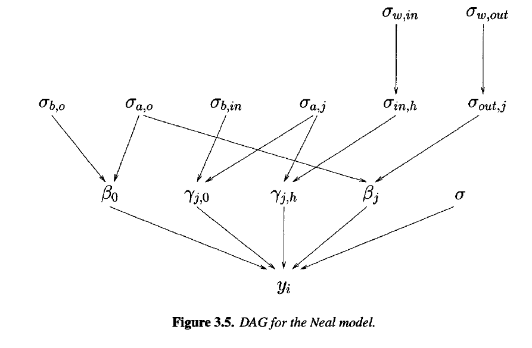

```{r setup, include=FALSE}
knitr::opts_chunk$set(echo = TRUE)
```

## Introduction

These Simulation are made to see an alternative way to fit Neural Networks instead of using the usual methods (like back-propagation or resilient back-propagation).
So to reach this goal I used three different ways to set the priors for the weights:

1.  The proposed, by Muller and Rios Insua, three-stage hierarchical priors

2.  Neal (1996) suggested priors.

3.  Conjugate Piors for weights of the output layer and precision, while limited-flat
    prior for the hidden layer weights.
    
After the exposition of the model there is the convergence analysis for the differents MCMC algorithm.  

# First proposed priors

Most standard priors for neural networks in the literature are hierarchical proper priors, because there are useful for neural networks for the lack of interpretability of the parameters. As the addition of levels to the prior reduces the influence of the particular choice made at the top level, the resulting prior at the bottom level (the original parameter) will be more diffuse, more closely macthing the lack of information we really have about the parameters themselves. This approach lets the data have more influence on the posterior.

Let's us take a look on Muller and Rios Insua (1998) proposed priors:

.

\newpage

Prior distributions, many of them, are multivariate, and are chosen to be conditionally conjugate, which will help in fitting the model.

The distribution for the parameters and hyperparameters are

.

where $\alpha_{\beta}$, $A_{\beta}$,$\alpha_{\gamma}$, $A_{\gamma}$,
$c_{\beta}$, $C_{\beta}$,,$c_{\gamma}$, $C_{\gamma}$, $s$ and $S$ are costants that need to be chosen a priori.

\newpage

# Second proposed priors

Neal suggests a more complex model, although all parameters are univariate. He also use hyperbolic tangent activation functions rather than logistic functions.

A simple version of the model is:

.

where $\alpha_0$, $\alpha_1$, $\alpha_2$, $\alpha_a$, $\alpha_b$, $\omega_0$, $\omega_a$ and $\omega_b$ are constants to be specified. A DAG diagram off the model is shown in next page.

\newpage

.

Each of the original network parameters ($\beta$ and $\gamma$) is treated as a univariate normal with mean zero and its own variance. These variances are the product of two hyperparameters, one for the originating node of the link in the graph and one for the destination node.

For example, the weight for the first input to the first hidden node, $\gamma_{11}$, has distribution $N(0, \sigma_{in, 1}* \sigma_{a,1})$, where $\sigma_{in,h}$ is the term for the link from the __h__-th input, and $\sigma_{a,j}$ is the term for the links into the __j__-th hidden node; the weight from the first hidden node to the output (i.e. the regression coefficient), $\beta_1$, has distribution $N(0, \sigma_{out,1}*\sigma_{0})$,
where $\sigma_{out,j}$ is the term for the links from the __j__-th hidden node, and $\sigma_0$ is the term for links to the output node. For all off the new $\sigma$ parameters and for the original $\sigma$ of the error term, there's an inverse-gamma distribution.

The version of the model presented here is for a univariate response; this model extends to multivariate responses and classification by adding an additional output unit for each dimension of the response and extending the hierarchy to account for additional output units. One further note on this model is that Neal also discusses using t distribution instead of normal distributions for the parameters, resulting in a more robust model.

\newpage

# Third proposed model.... Conjugate priors for beta and variance and flat prior for gamma

As we know the last layer of a neural network is a linear regression on the hidden layer outputs, so let's assume that the X in input on the NN becomes Z in the hidden layer (so for fixed $\gamma$ we have a linear on last layer).

$$z_{ij} = \Bigg[ 1 + exp\big( - \gamma_{j0} + \sum_{h=1}^r \gamma_{jh}*x_{ih}\big)\Bigg]$$

So the ouput layer is fitting a linear regression in this Z data.

$$y_i = z_i^T \beta + \epsilon_i$$
with $\epsilon \sim N(0,\sigma^2)$, so the likelihood function is :

$$p(y|Z,\beta, \sigma^2) \propto (\sigma^2)^{-n/2} \cdot exp \Big( - \frac{1}{2\sigma^2}(y - Z\beta)^T(y - Z\beta)\Big)$$

and the orinary least squares solution is: $\hat\beta = (Z^T Z )^{-1} Z^Ty$ 

Using a little trick:

$$(y - Z\beta)^T(y - Z\beta) = (y - Z\hat\beta)^T(y - Z\hat\beta) + (\beta- \hat\beta)^T(Z^TZ)(\beta- \hat\beta)$$
So the likelihood is now re-written as:

$$p(y|Z,\beta, \sigma^2) = (\sigma^2)^{-\frac{n - (k+1)}{2}}|\mathbf{Z^TZ}|^{-\frac{1}{2}} exp\Big( - \frac{(y - Z\hat\beta)^T(y - Z\hat\beta)}{2\sigma^2} \Big) \cdot (\sigma^2)^{-\frac{k+1}{2}} |\mathbf{Z^TZ}|^{\frac{1}{2}} exp\Big( - \frac{(\beta- \hat\beta)^T(Z^TZ)(\beta- \hat\beta)}{2\sigma^2} \Big)$$

This suggests a form for the prior:
$$p(\sigma^2,\beta) = p(\sigma^2)p(\beta|\sigma)$$

Where $p(\sigma^2)$ is an inverse-gamma distribution with $a_0 = \frac{n_0-k_0}{2}$ and $b_0 = \frac{SSE_0}{2}$,

while $p(\beta|\sigma^2)$ is a normal distribution $N(\mu_0, \sigma^2\Lambda_0^{-1})$

So follows that the posterior distribution are $N(\mu_n, \sigma^2 \Lambda_n^{-1})$ and $In$-$Gamma(a_n, b_n)$ distributions, with parameters given by:

$$\mathbf{\Lambda_n = (Z^TZ +\Lambda_0), \qquad \mu_n =(\Lambda_n)^{-1}(Z^Ty + \Lambda_0\mu_0)}$$
$$a_n= a_0+\frac{n}{2} ,\qquad b_n = b_0+ \frac{1}{2}(\mathbf{y}^T\mathbf{y} + \mathbf{\mu}_0^T\mathbf{\Lambda}_0\mathbf{\mu}_0 - \mathbf{\mu}_n^T \mathbf{\Lambda}_n\mathbf{\mu}_n)$$


So everythings looks easy for Beta and the variance, but the priors for the $\gamma$ parameters is a more tender question, as they are the ones that are particulary lacking in interpretation. One obvious approach is to use a flat prior for them, but since this prior is improper and leads to an improper posterior (it turns out that there are two ways in which things can go wrong: linear independence and tail behavior), we restrict this priors. The discussion of this prior first appeared in Lee (2003).

\newpage

To understand the linear independence problem, let's see how the posterior will be proper as long as the design matrix $Z$ is full rank. Thus, for a neural network, we need the k logistic basis function to be linearly independent. A straightforward way to ensure linear independence is to require that the determinant of $Z^TZ$ is positive, or for computational purpose the determinant should be larger than some small positive number C.

The second possible posterior propriety is that the likelihood does not necessarily go to zero in the tails, converging to various nonzero constant. If the tails of the prior also do not go to zero as the parameter  values go off to infinity, the tails of the posterior will similary fail to go to zero, and thus the posterior will not have finite integral unless the parameter space is bounded, so wee want that $|\gamma_{jh}|<D$.


### Proof that the posterior is a proper distribution

$$\int L_n P_n = \int_{\Omega_n} f(\mathbf{\beta}| \mathbf{\gamma},\sigma, \mathbf{y})\pi(\mathbf{\beta}|\mathbf{\gamma},\sigma) f(\mathbf{\gamma},\sigma| \mathbf{y})\pi(\sigma|\mathbf{\gamma} ) I_{\gamma \in \Gamma_n} d\beta d \gamma d\sigma  $$
$$= \int_{\Gamma_n} \int \Bigg[\int f(\mathbf{\beta}| \mathbf{\gamma},\sigma, \mathbf{y})\pi(\mathbf{\beta}|\mathbf{\gamma},\sigma) d \beta \Bigg] \pi(\sigma|\gamma)f(\mathbf{\gamma},\sigma|\mathbf{y}) d \sigma d \gamma =$$


$$= \int_{\Gamma_n} \int \pi(\sigma|\gamma)\cdot (\sigma^2)^{-\frac{n - (k+1)}{2}}|\mathbf{Z^TZ}|^{\frac{1}{2}} exp( - \frac{(Y^TY - \hat Y^T \hat Y))}{2\sigma^2}) d \sigma d \gamma \leq$$

$$\leq \int_{\Gamma_n} \int \sigma^{-\alpha - 1} \cdot \sigma^{-n+k+1} |\mathbf{Z^TZ}|^{\frac{1}{2}} d \sigma d\gamma < B$$
The last integral is finite becouse $\Gamma_n$ is a bounded set.

where $\Omega_n$ is the true parameter space, while $\Gamma_n$ is the subspace related to the parameters $\gamma$.

So we can assume that also for gamma we have a finite posterior distribution that this time doesn't appear in the parametric family distributions... so we need to implement for this last variables a Metropolis-Hasting simulation using simmetric proposal distribution to make things easier.


\newpage

## Implementation

1) First case was simulated with WinBugs, is a simulation of 10000 iteration with thin equal to 7.

2) Second case was simulated with Jags, there are more simulation of 10000 and 100000 iteration with thin equal to 1.

3) Third case was simulated in R and is a simulation of 10000 iteration with thin equal to 5.


## Convergence Diagnostics

*"a weak diagnostic is better than no diagnostic at all" (Cowles & Carlin, 1996)*

To make Bayesian analysis we need to be sure that the chain is converged to the invariant distribution (posterior distribution), so to reach this goal we need to do some convergence diagnostic; and I made:

1)  Time-series Plots for the parameters of interest: that needs to be wiggly to make sure that the chain has traversed different parts of the sample space or if there is a clean pattern in such a plot, the MCMC algorithm may not have converged.

2)  Running-mean plots for the parameters of interest: if the algorithm has converged, the running mean should stabilize at the posterior mean for each parameter. However, these plots look only at the mean of the parameters and hence are inadequate.

3)  Plot of auto-correlation function: An MCMC algorithm generating higlhy autocorrelated parameter values will need a large number of iterations to be able to traverse the whole sample space of the parameters.

4) Cross-correlation plots: high values of this last mesure may indicate the need for a reparametrization of the model.

5)Spectral Analysis:

  -   **'Geweke Convergence diagnostic'** that make a Z-statitic using the mean of first 10% of the chain whit the 50% of the last part of the chain.

  -   **'Heidelberger and Welch Convergence diagnostic'** that calculate the test statistics on the whole chain to accept or reject the null hypothesis that the chain is from a stationary distribution in the first part, and in the second part the halfwidth test, calculates half the width of the (1 - alpha)% probability interval (credible interval) around the mean. If the ratio of the halfwidth and the mean is lower than eps, then the chain passes the halfwidth test. Otherwise, the chain fails the halfwidth test and must be updated for more iterations until sufficient accuracy is obtained.

6) fit of the model by seeing the posterior predictive distribution and the p-value observed whit the initial data

7) trace plot of the log-likelihood: if the density is going down, the chain probably started near a mode around which there is a little probability mass and is going to a more rapresentative part of the distribution.


\newpage

## References

-   Herbert K. H. Lee "Bayesian Nonparametrics via Neural Networks"
-   Christian P.Robert  George Casella  "Monte Carlo Statistical Methods" second edition
-   Ioannis Ntzoufras  "Bayesian Modeling Using WinBugs"
-   Wikipedia Bayesian linear regression <https://en.wikipedia.org/wiki/Bayesian_linear_regression>
